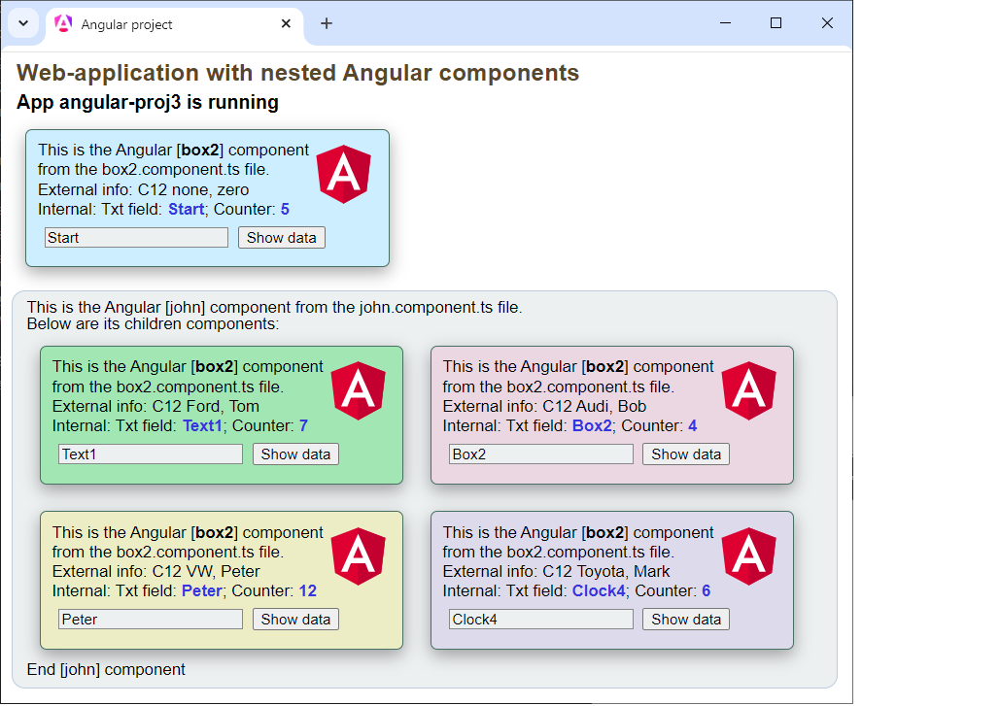

# Web-application with nested Angular components

The project demonstrates the use of nested components and passing control data between them from parent to child.

- Angular project created by ng, written in TypeScript;
- This project requires installation of ng libraries via node.js npm;
- The project defines 3 components that transmit data using the @Input decorator;
- Ng library version 17.0.0;
- Project written in Visual Studio Code.

.

